# 📚 Esimko Application Documentation

## Overview

**eSIMKO** = Elektronik Sistem Informasi dan Manajemen Koperasi

A comprehensive cooperative management system built with Laravel 7.x, providing:
- Member savings & loan management
- Point of Sale (POS)
- Financial accounting
- Mobile API
- Payroll integration

---

## 🏗️ Architecture


### Tech Stack

| Layer | Technology |
|-------|------------|
| Backend | Laravel 7.x / PHP 7.4 |
| Database | MySQL |
| Frontend | Blade Templates + jQuery |
| CSS | Bootstrap 4 |
| PDF | DomPDF |
| Excel | Laravel Excel |

---

## 📱 Features (Modules)

### 1. Member Management (`anggota`)

| Feature | Route | Description |
|---------|-------|-------------|
| List Members | `/anggota` | View all cooperative members |
| Add Member | `/anggota/form` | Register new member |
| Member Detail | `/anggota/detail` | View member profile & history |

**Member Status Types:**
- `1` = Pending (Menunggu Verifikasi)
- `2` = Active Payroll (Anggota Aktif Payroll)
- `3` = Active Non-Payroll
- `4` = Inactive (Non-aktif)
- `5` = Active Non-Payroll (different type)

---

### 2. Savings Management (`simpanan`)

| Type ID | Name | Description |
|---------|------|-------------|
| 1 | Simpanan Pokok | Principal savings (one-time) |
| 2 | Simpanan Wajib | Mandatory monthly savings |
| 3 | Simpanan Sukarela | Voluntary savings |
| 4 | Simpanan Hari Raya | Holiday savings |
| 5 | Bunga Simpanan | Interest on savings |
| 6 | Penarikan Sukarela | Voluntary withdrawal |
| 7 | Penarikan Hari Raya | Holiday withdrawal |
| 8 | Penutupan Simpanan | Account closure |

**Routes:**
```
/simpanan/sukarela        - Voluntary savings
/simpanan/payroll         - Payroll deduction savings
/simpanan/bunga           - Interest posting
/simpanan/buku_simpanan   - Savings passbook
/penarikan/sukarela       - Withdrawals
/penarikan/hari_raya      - Holiday withdrawals
/penarikan/penutupan      - Account closure
```

---

### 3. Loan Management (`pinjaman`)

| Type ID | Name | Max Tenor |
|---------|------|-----------|
| 9 | Pinjaman Jangka Panjang | 50 months |
| 10 | Pinjaman Jangka Pendek | 18 months |
| 11 | Pinjaman Barang | 18 months |

**Business Rules:**
- Total installment ≤ 50% of member's salary
- Must clear existing loan before new loan of same type
- 1% monthly interest rate

**Routes:**
```
/pinjaman/pengajuan       - Loan application
/pinjaman/payroll         - Payroll deduction installments
```

---

### 4. Point of Sale (`pos`)

| Feature | Route | Description |
|---------|-------|-------------|
| New Sale | `/pos/penjualan_baru` | POS cashier interface |
| Sales List | `/pos/penjualan` | View all sales |
| Shopping | `/pos/belanja/{jenis}` | Member shopping (toko/konsinyasi/online) |
| Returns | `/pos/return` | Product returns |
| Installments | `/pos/angsuran` | Credit payment installments |

**Sale Types:**
- `toko` = In-store purchase
- `konsinyasi` = Consignment
- `online` = Online/marketplace

**Payment Methods:**
- `1` = Cash (Tunai)
- `2` = Debit Card
- `3` = Credit/Installment (Kredit)

---

### 5. Inventory Management (`manajemen_stok`)

| Feature | Route |
|---------|-------|
| Products | `/manajemen_stok/barang` |
| Suppliers | `/manajemen_stok/supplier` |
| Purchases | `/manajemen_stok/pembelian` |
| Purchase Returns | `/manajemen_stok/return` |
| Stock Opname | `/manajemen_stok/stok_opname` |
| Barcode Printing | `/manajemen_stok/cetak/barcode_barang` |
| Price Label Printing | `/manajemen_stok/cetak/label_harga` |

**Stock Calculation Formula:**
```
Stock = stok_awal + pembelian - retur_pembelian - terjual + retur_penjualan + penyesuaian
```

---

### 6. Financial Accounting (`keuangan`)

| Feature | Route |
|---------|-------|
| Chart of Accounts | `/keuangan/akun` |
| General Journal | `/keuangan/jurnal` |
| General Ledger | `/keuangan/buku_besar` |
| Balance Sheet | `/keuangan/neraca` |
| Income Statement | `/keuangan/laba_rugi` |

---

### 7. Reports

| Report | Route |
|--------|-------|
| Sales Report | `/pos/laporan_penjualan` |
| Purchase Report | `/pos/laporan_pembelian` |
| Stock Report | `/pos/laporan_stock` |
| Mutation Report | `/pos/laporan_mutasi` |
| Payroll Report | `/laporan/payroll` |

---

## 🗄️ Database Schema

### Core Tables


### Key Tables

| Table | Description | Rows (approx) |
|-------|-------------|---------------|
| `anggota` | Members | 1,500+ |
| `transaksi` | Financial transactions | 89,000+ |
| `penjualan` | Sales | 20,000+ |
| `produk` | Products | 5,000+ |
| `angsuran` | Loan installments | - |
| `pembelian` | Purchases | - |
| `user_akses` | User role assignments | 1,500+ |
| `hak_akses` | Role definitions | 6 |

### Role Definitions (`hak_akses`)

| ID | Role Name |
|----|-----------|
| 1 | Administrator |
| 2 | Anggota (Member) |
| 3 | Operator Simpan Pinjam |
| 4 | (Other roles) |
| 5 | (Other roles) |
| 6 | Executive User |

---

## 🔧 Backend Architecture

### Controllers (54 total)

| Category | Controllers | Purpose |
|----------|-------------|---------|
| **Auth** | `AuthController` | Login, logout, registration |
| **Members** | `AnggotaController`, `ProfilController` | Member management |
| **Savings** | `SimpananController`, `PayrollSimpananController`, `BungaSimpananController` | Savings operations |
| **Loans** | `PinjamanController`, `PayrollPinjamanController` | Loan operations |
| **Withdrawals** | `PenarikanController` | Withdrawal operations |
| **POS** | `PenjualanController`, `PenjualanBaruController`, `KeranjangController` | Point of sale |
| **Inventory** | `ProdukController`, `PembelianController`, `SupplierController`, `StokOpnameController` | Stock management |
| **Finance** | `AkunController`, `JurnalController`, `NeracaController`, `LabaRugiController` | Accounting |
| **Reporting** | `LaporanPenjualanController`, `LaporanStockController`, `CetakPayrollController` | Reports |
| **API** | `ApiController`, `MobileController` | REST endpoints |
| **Master** | `MasterController`, `PengaturanController` | Settings/master data |

### Helper Functions (`GlobalHelper.php` - 858 lines)

**Financial Calculations:**
```php
saldo_tabungan($anggota, $jenis)     // Get savings balance
sisa_pinjaman($anggota, $jenis)      // Get remaining loan balance
angsuran_pinjaman($anggota, $jenis)  // Get monthly installment
angsuran_belanja($anggota, $jenis)   // Get shopping installment
setoran_berkala($anggota)            // Get recurring deposit amount
gaji_pokok($anggota)                 // Get base salary
validasi_pinjaman($id)               // Validate loan eligibility
```

**Stock Calculations:**
```php
stok_barang($id)                     // Calculate current stock
// Returns: stok_awal, pembelian, retur, terjual, sisa, penyesuaian
```

**Number Generators:**
```php
get_nomor_anggota($lokasi)           // Generate member number (K 0001, AK 0001)
get_nomor_penjualan($waktu)          // Generate sales number
get_nomor_pembelian($tanggal)        // Generate purchase number
get_nomor_jurnal($kode, $tanggal)    // Generate journal number
```

**Utilities:**
```php
dateFormat($date, $format)           // Date formatting
tgl_indo($tgl)                       // Indonesian date format
nama_bulan($bulan)                   // Month name in Indonesian
otoritas_modul($hak_akses, $modul)   // Check user permissions
```

---

## 🌐 API Endpoints

### Web API (Internal)

| Endpoint | Method | Purpose |
|----------|--------|---------|
| `/api/find_anggota/{id}` | GET | Get member details |
| `/api/find_produk/{id}` | GET | Get product details |
| `/api/get_anggota/{status}/{search}` | GET | Search members |
| `/api/get_produk/{supplier}/{search}` | GET | Search products |

### Mobile API

| Endpoint | Method | Purpose |
|----------|--------|---------|
| `/api/mobile/auth/login` | POST | Mobile login |
| `/api/mobile/auth/register` | POST | Mobile registration |
| `/api/mobile/anggota/profil` | GET | Get member profile |
| `/api/mobile/transaksi/{modul}` | GET | Get transactions |
| `/api/mobile/produk` | GET | Get products |
| `/api/mobile/belanja/keranjang` | GET | Get shopping cart |

---

## 🎨 Frontend Structure

### Layout Templates

| Layout | Purpose |
|--------|---------|
| `admin.blade.php` | Admin dashboard layout (31KB) |
| `main.blade.php` | Member portal layout (26KB) |
| `kasir.blade.php` | POS/Cashier layout (26KB) |
| `landing_page.blade.php` | Public landing page (26KB) |
| `auth.blade.php` | Login/Register pages (5KB) |
| `report.blade.php` | PDF report layout |

### View Directories

```
resources/views/
├── anggota/           # Member management
├── auth/              # Login, register, confirm
├── dashboard.blade.php
├── include/           # Partials (modals, forms)
├── kasir/             # POS interface
├── keuangan/          # Finance views
├── landing_page/      # Public pages
├── layouts/           # Base templates
├── main/              # Member portal
├── manajemen_stok/    # Inventory
├── master/            # Master data
├── monitoring/        # Monitoring views
├── payroll/           # Payroll reports
├── penarikan/         # Withdrawals
├── pengaturan/        # Settings
├── pinjaman/          # Loans
├── pos/               # Point of sale
├── profil/            # Profile pages
└── simpanan/          # Savings
```

---

## 🔒 Authentication & Authorization

### Middleware

| Middleware | Purpose |
|------------|---------|
| `CekLogin` | Session-based authentication check |

### Permission System

Permissions stored in `otoritas_user` table:
- `is_view` - Can view module
- `is_insert` - Can add data
- `is_update` - Can edit data
- `is_delete` - Can delete data
- `is_all_user` - Can see all users' data
- `is_print` - Can print/export
- `is_verified` - Can verify transactions

---

## 📊 Transaction Flow

### Savings Flow

```mermaid
flowchart LR
    A[Member] --> B[Create Transaction]
    B --> C{Payment Method}
    C -->|Payroll| D[Add to Payroll Batch]
    C -->|Cash| E[Direct Verification]
    D --> F[Batch Processing]
    E --> G[Verified ✓]
    F --> G
```


### Loan Flow

```mermaid
flowchart TB
    A[Member Applies] --> B{Eligibility Check}
    B -->|Pass| C[Create Loan]
    B -->|Fail| X[Rejected]
    C --> D[Generate Installment Schedule]
    D --> E[Awaiting Approval]
    E --> F[Approved]
    F --> G[Active Loan]
    G --> H[Monthly Installments]
    H --> I{All Paid?}
    I -->|No| H
    I -->|Yes| J[Loan Closed ✓]
```


### POS Sale Flow


---

## 📁 File Structure Summary

```
esimko/
├── app/
│   ├── Http/
│   │   ├── Controllers/     # 54 controllers
│   │   └── Middleware/      # Auth middleware
│   ├── Helpers/
│   │   ├── GlobalHelper.php # 858 lines core logic
│   │   └── GlobalHelper2.php
│   ├── Exports/             # Excel exports
│   └── [56 Model files]     # Eloquent models
├── config/
├── database/
├── public/
├── resources/
│   └── views/               # 19 view directories
├── routes/
│   ├── web.php              # 540 lines
│   └── api.php              # 71 lines
└── storage/
```

---

## 🔢 Key Business Constants

```php
// Member number prefix
'K'  = Karyawan (Employee)
'AK' = Anggota Koperasi (Cooperative Member)

// Interest rate
LOAN_INTEREST = 0.01 (1% per month)

// Mandatory savings
MANDATORY_SAVINGS = 350000 (Rp 350,000/month)

// Loan eligibility
MAX_INSTALLMENT_RATIO = 0.5 (50% of salary)
```
