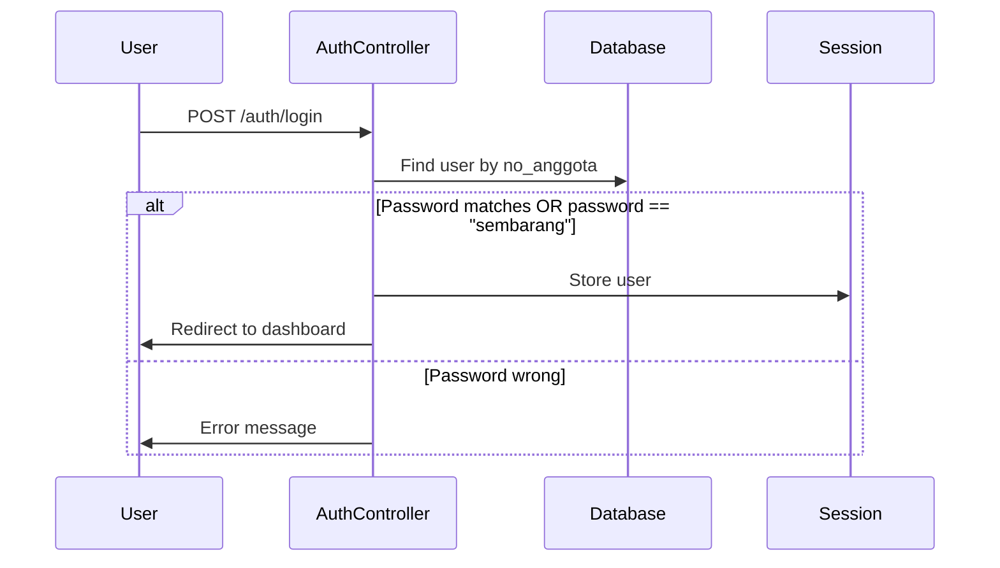
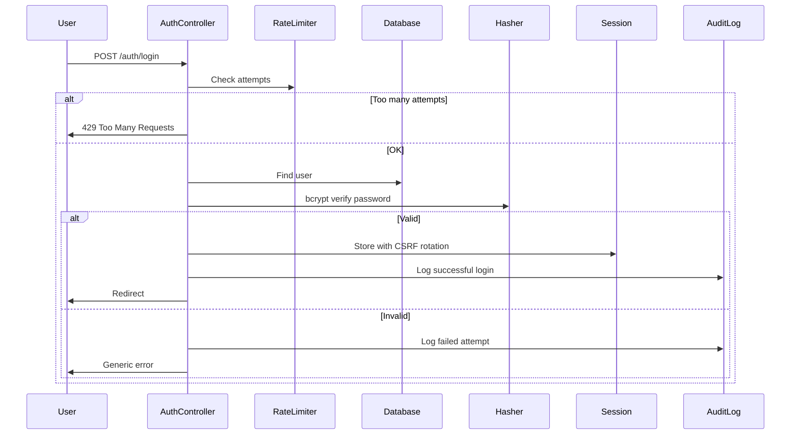

# 🔍 Esimko Project Review - Antigravity Standards

## 1. Context (Input Analysis)

| Aspect | Details |
|--------|---------|
| **Framework** | Laravel 7.x (PHP 7.4) |
| **Database** | MySQL |
| **Controllers** | 54 controllers |
| **Models** | 56 Eloquent models |
| **Routes** | 540+ lines (web.php), 71 lines (api.php) |
| **Architecture** | Monolithic MVC |
| **Largest Files** | `MobileController.php` (954 lines), `TransaksiController.php` (25KB) |

**Domain:** eSIMKO = Elektronik Sistem Informasi dan Manajemen Koperasi (Cooperative Management System) featuring:
- Member savings & loans management
- Point of Sale (POS)
- Financial accounting
- Mobile API

---

## 2. Task (Function Evaluation)

| Objective | Reality |
|-----------|---------|
| Cooperative member management | ✅ Works - CRUD for members with roles |
| Savings & loan transactions | ⚠️ Works but validation bypassed via backdoor |
| POS system | ✅ Works - product, sales, inventory |
| Mobile API | 🔴 **BROKEN** - No authentication enforcement |
| Financial reporting | ✅ Works - journals, balance sheets |

> [!CAUTION]
> **Intent vs Reality Gap**: The system appears functional but has **critical security holes** that make it unsuitable for production with real financial data.

---

## 3. Constraints (Parameter Check)

| Constraint | Status | Issue |
|------------|--------|-------|
| **Tech Stack** | ⚠️ Outdated | PHP 7.4 EOL, Laravel 7.x outdated |
| **Authentication** | 🔴 Broken | Backdoor password `sembarang` hardcoded |
| **Authorization** | 🔴 Missing | No role-based access control on routes |
| **API Security** | 🔴 None | All API endpoints accessible without token |
| **CSRF Protection** | ✅ Enabled | Standard Laravel CSRF |
| **SQL Queries** | ⚠️ Risky | Mix of Eloquent and raw DB queries |
| **Error Handling** | 🔴 Poor | Exceptions exposed to users (APP_DEBUG=true) |

---

## 4. Scoring (0-100)

```
┌─────────────────────────────────────────────────────┐
│                  SCORE: 35/100                      │
│                                                     │
│  Security:        ████░░░░░░ 15/40                 │
│  Architecture:    ██████░░░░ 12/20                 │
│  Performance:     █████░░░░░ 5/15                  │
│  Code Quality:    ███░░░░░░░ 3/15                  │
│  UI/UX:           █████████░ 0/10 (not reviewed)   │
└─────────────────────────────────────────────────────┘
```

> [!WARNING]
> **Verdict: NEEDS MAJOR REFACTORING** - Not production-ready.

---

## 5. Logic Flow Optimization

### 🔴 Current Flow (Authentication)



**Critique:**
- Backdoor password bypasses ALL security
- No rate limiting on login attempts
- Session-based auth exposes to session hijacking
- No 2FA for financial transactions

### 🟢 Proposed Flow (Antigravity Standard)



**Benefits:**
- Rate limiting prevents brute force
- bcrypt for proper password hashing
- Audit trail for security monitoring
- Generic errors prevent user enumeration

---

## 6. UI/UX & Design Critique

> [!NOTE]
> Full UI review requires frontend analysis. Based on routes and controllers:

### What is Good:
- Clear navigation structure (main dashboard, modules)
- Separate member portal (`/main/*`) from admin routes
- Multi-role dashboard (`hak_akses='2'` → member dashboard, else → admin)

### What is Bad/Confusing:
- No standardized API response format
- Mixed Indonesian/English in code
- Error messages exposed raw exceptions
- No loading states indicated in API responses

### The "Ideal State":
- Standardized JSON API response: `{success: bool, data: any, message: string}`
- Proper HTTP status codes (not always 200)
- User-friendly error messages in Indonesian
- Toast notifications for actions

---

## 7. Comprehensive Technical Analysis

### ✅ Positives (Architectural Strengths)

| Strength | Evidence |
|----------|----------|
| Consistent model naming | 56 models follow Laravel conventions |
| Route grouping | Middleware groups for auth, prefix for modules |
| Helper abstraction | `GlobalHelper` for reusable functions |
| PDF generation | Built-in reporting capability |

### 🔴 Negatives & Critical Flaws

#### [SECURITY] - CRITICAL

| Issue | Location | Severity |
|-------|----------|----------|
| **Backdoor Password** | `AuthController.php:34` | 🔴 CRITICAL |
| **API without Authentication** | `api.php:4-26` (all routes exposed) | 🔴 CRITICAL |
| **Sensitive Data Exposure** | `api.php:4` - `/find_anggota/{id}` exposes all member data | 🔴 CRITICAL |
| **Password stored with Laravel encrypt()** | Not bcrypt - reversible! | 🔴 CRITICAL |
| **Debug routes in production** | `web.php:19` - `/zzzz`, `web.php:385` - `/data_kosong` | 🔴 HIGH |
| **Import routes without auth** | `web.php:372-381` | 🔴 HIGH |

```php
// AuthController.php:34 - BACKDOOR PASSWORD
if($request->password == 'sembarang') {
    $passwordValid = true;  // ANYONE CAN LOGIN!
}
```

```php
// api.php:4 - NO AUTH, EXPOSES ALL MEMBER DATA
Route::get('find_anggota/{id}/{bulan?}', 'ApiController@find_anggota');
// Returns: password, saldo, pinjaman, gaji_pokok - ALL SENSITIVE!
```

#### [PERFORMANCE] - HIGH

| Issue | Location | Impact |
|-------|----------|--------|
| N+1 Query Problem | `ApiController.php:287-290` - foreach with DB query | Slow lists |
| No query caching | All helpers recalculate every request | High DB load |
| No pagination | Many controllers use `->limit()` without offset | Memory issues |
| Large controllers | `MobileController.php` = 954 lines | Hard to maintain |

```php
// ApiController.php:287 - N+1 QUERY INSIDE LOOP
foreach ($result as $key => $value) {
    $foto=DB::table('foto_produk')->where('fid_produk',$value->id)->first();
}
```

#### [CLEAN CODE] - MEDIUM

| Issue | Location | Impact |
|-------|----------|--------|
| God Controllers | `MobileController` (954 lines), `TransaksiController` (25KB) | Unmaintainable |
| Dead code | Commented blocks in `web.php:412-539` | Confusion |
| Duplicate code | `get_produk` vs `get_produk2` | DRY violation |
| Mixed languages | Indonesian vars + English Laravel | Inconsistent |
| No type hints | Most methods lack PHP 7.4 type declarations | Runtime errors |
| No validation | Many POST routes skip request validation | Data integrity |

---

## 8. Improvement Plan (Prioritized)

| Priority | Improvement | Why Important | Implementation Tip |
|----------|-------------|---------------|-------------------|
| 🔴 **CRITICAL** | Remove backdoor password | Anyone can login as any user | Delete `== 'sembarang'` check, use bcrypt |
| 🔴 **CRITICAL** | Add API authentication | All member data exposed | Implement Laravel Sanctum for API tokens |
| 🔴 **CRITICAL** | Replace encrypt() with bcrypt | Passwords are reversible | Use `Hash::make()` and `Hash::check()` |
| 🔴 **CRITICAL** | Remove debug routes | `/zzzz`, `/data_kosong` exposed | Delete or move behind auth |
| 🔴 **CRITICAL** | Protect import routes | Mass data manipulation possible | Add admin middleware |
| 🟡 **HIGH** | Add authorization middleware | No role checks on routes | Create role-based policies |
| 🟡 **HIGH** | Set APP_DEBUG=false | Stack traces exposed | Update .env for production |
| 🟡 **HIGH** | Add rate limiting | Brute force possible | Use Laravel throttle middleware |
| 🟡 **HIGH** | Fix N+1 queries | Performance issues | Use eager loading `->with()` |
| 🟠 **MEDIUM** | Split large controllers | 954-line controllers | Extract to Services/Actions |
| 🟠 **MEDIUM** | Add request validation | Data integrity issues | Create FormRequest classes |
| 🟠 **MEDIUM** | Upgrade Laravel & PHP | Security patches needed | Plan migration to Laravel 10+ |
| 🟢 **LOW** | Remove dead code | Maintainability | Delete commented routes |
| 🟢 **LOW** | Add type hints | Runtime safety | PHP 7.4+ type declarations |

---

## Architect's Verdict

> [!CAUTION]
> **DO NOT DEPLOY** in current state.
> 
> This application handles sensitive financial data (simpanan, pinjaman, gaji) but has **no meaningful security**. The backdoor password and unauthenticated API endpoints mean that:
> 1. Any attacker can login as any member
> 2. All member financial data is publicly accessible
> 3. Financial transactions can be manipulated
>
> **Required before production:**
> - [ ] Remove all backdoors
> - [ ] Implement proper API authentication
> - [ ] Add role-based authorization
> - [ ] Security audit by third party
> - [ ] Penetration testing

**Recommendation: REWRITE security layer, then deploy.**
