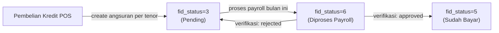

# Root Cause Analysis & Fix Plan: POS Limit Pinjaman

## Business Logic (Setelah Analisa Mendalam)

### Angsuran Belanja Lifecycle



| Status | Arti | Contoh |
|--------|------|--------|
| **3** | Pending (belum dibayar) | Angsuran yang belum masuk payroll |
| **6** | Diproses payroll | Sudah di-assign ke payroll bulan tertentu |
| **5** | Sudah dibayar/verified | Verifikasi selesai |

### Formula Limit yang Benar

```
Limit = 1.500.000 - SUM(total_pembayaran dari penjualan yang MASIH punya hutang)
      + total_retur
```

**"Masih punya hutang"** = penjualan yang masih punya angsuran dengan `fid_status=3` (pending).

Jika SEMUA angsuran suatu penjualan sudah `fid_status=5` atau `fid_status=6`, maka penjualan itu TIDAK lagi mengurangi limit karena sudah dibayar/diproses.

---

## Root Cause (2 Masalah)

### Masalah 1: Menggunakan `total_angsuran` bukan `total_pembayaran`

**File:** [GlobalHelper.php](file:///e:/Vibe/Esimko/app/Helpers/GlobalHelper.php#L867-L897)

```php
// SALAH: menggunakan angsuran_belanja.total_angsuran (cicilan per bulan)
return $limit - $angsuran->sum('total_angsuran') + $total_retur;
```

`total_angsuran` = jumlah cicilan per bulan (misal 33,660 untuk K 1741 penjualan 86145)
`total_pembayaran` = total pembelian (misal 16,830 untuk penjualan yang sama)

> [!CAUTION]
> Untuk penjualan 86145 (K 1741): GROUP BY mengambil `total_angsuran=33,660` padahal `total_pembayaran=16,830`. Selisih = 16,830.

### Masalah 2: GROUP BY non-deterministic menginclude penjualan yang sudah lunas

GROUP BY trick pada MySQL 8 (`ONLY_FULL_GROUP_BY`) menyebabkan:
- Penjualan yang sudah TIDAK punya angsuran pending tetap ter-include
- Contoh: penjualan 100810 (K 1215, 2,000) sudah lunas tapi masih dihitung

---

## Bukti Perhitungan

### K 1215 (Expected: 796,110 | Actual: 794,110 | Diff: 2,000)

| Penjualan | total_pembayaran | Seharusnya dihitung? | Alasan |
|-----------|-----------------|---------------------|--------|
| 90133 | 442,750 | ✅ Ya | Masih ada angsuran pending |
| 92473 | 219,890 | ✅ Ya | Masih ada angsuran pending |
| 99248 | 41,250 | ✅ Ya | Masih ada angsuran pending |
| 100810 | 2,000 | ❌ Tidak | Sudah lunas (tidak ada angsuran pending) |

**Correct:** 1,500,000 - (442,750 + 219,890 + 41,250) = **796,110** ✅

### K 1741 (Expected: 1,155,920 | Actual: 1,119,090 | Diff: 36,830)

| Penjualan | total_pembayaran | Seharusnya dihitung? |
|-----------|-----------------|---------------------|
| 82250 | 55,000 | ✅ Ya |
| 83768 | 20,350 | ✅ Ya |
| 84340 | 42,900 | ✅ Ya |
| 86145 | 16,830 | ✅ Ya |
| 92328 | 209,000 | ✅ Ya |
| 100715 | 2,000 | ❌ Tidak |
| 100755 | 4,500 | ❌ Tidak |
| 100762 | 6,500 | ❌ Tidak |
| 100996 | 4,500 | ❌ Tidak |
| 101009 | 2,500 | ❌ Tidak |

**Correct:** 1,500,000 - (55,000 + 20,350 + 42,900 + 16,830 + 209,000) = **1,155,920** ✅

---

## Proposed Fix

### [MODIFY] [GlobalHelper.php](file:///e:/Vibe/Esimko/app/Helpers/GlobalHelper.php#L867-L897)

```diff
 public static function limitKaryawan($anggota_id)
 {
     $limit = 1500000;
-    $list_id = Penjualan::where('fid_anggota', $anggota_id)->where('fid_metode_pembayaran', 3)
-        ->whereIn('fid_status', [2, 4])
-        ->select('id')->get()->pluck('id')->toArray();
-    $angsuran = AngsuranBelanja::select(DB::raw('a.*'))
-        ->whereIn('a.fid_penjualan', $list_id)
-        ->from(DB::raw('(SELECT * FROM angsuran_belanja where fid_status = 3 ORDER BY angsuran_ke ASC) a'))
-        ->groupBy('a.fid_penjualan')
-        ->with(['penjualan'])
-        ->get();
-    // ... debug code removed ...
-    $list_penjualan_id = $angsuran->pluck('fid_penjualan')->toArray();
-    // ... retur calculation ...
-    return $limit - $angsuran->sum('total_angsuran') + $total_retur;
+    // Get penjualan kredit yang MASIH punya angsuran pending (fid_status=3)
+    $penjualan_with_debt = Penjualan::where('fid_anggota', $anggota_id)
+        ->where('fid_metode_pembayaran', 3)
+        ->whereIn('fid_status', [2, 4])
+        ->whereHas('angsuran_belanja', function($q) {
+            $q->where('fid_status', 3);
+        })
+        ->get();
+
+    $total_hutang = $penjualan_with_debt->sum('total_pembayaran');
+    $list_penjualan_id = $penjualan_with_debt->pluck('id')->toArray();
+
+    // ... retur calculation (unchanged) ...
+    return $limit - $total_hutang + $total_retur;
 }
```

### Perubahan Kunci
1. **`whereHas('angsuran_belanja', fid_status=3)`** — Hanya include penjualan yang MASIH punya angsuran pending
2. **`sum('total_pembayaran')`** — Gunakan total pembelian dari penjualan, bukan cicilan dari angsuran

### Prerequisite: Relationship di Model Penjualan

Perlu dipastikan model `Penjualan` punya relationship `angsuran_belanja`. Jika belum ada, perlu ditambahkan.

---

## Verification Plan

Setelah fix, test via `artisan tinker`:
```
K 1215: expected 796,110
K 1741: expected 1,155,920  
K 1454: expected ~1,500,000 (atau sesuai user expectation)
```
