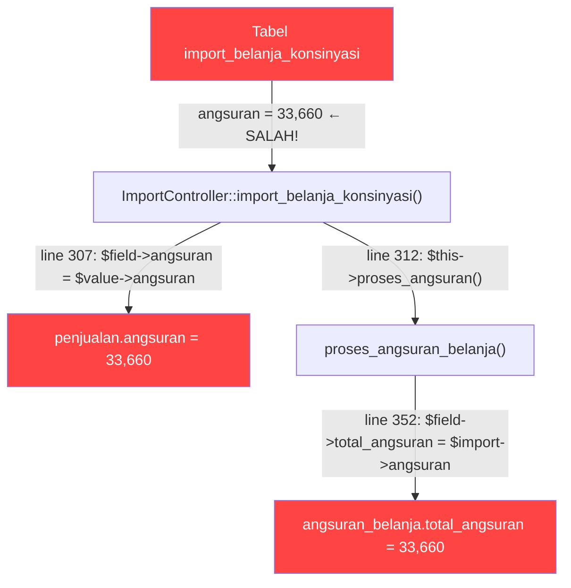

# Deep Root Cause Analysis: Double Angsuran Bug

## Overview
Penjualan 86145 (K 1741) memiliki `angsuran=33,660` padahal seharusnya **16,830** (2× lipat). Analisis ini menelusuri seluruh code path dan menemukan akar masalah.

---

## 3 Code Paths untuk Angsuran

### Path 1: POS Toko — [PenjualanController.php](file:///e:/Vibe/Esimko/app/Http/Controllers/PenjualanController.php#L303-L304)
```php
$field->tenor = 1;  // Selalu 1 cicilan
$field->angsuran = str_replace('.','', $request->total_pembayaran);
```
- Tenor selalu **1** → angsuran = total harga
- Angsuran_belanja dibuat via `proses_angsuran()` — hanya 1 entry (angsuran_ke=1)
- **Tidak relevan** untuk penjualan 86145 (yang tenor=10)

### Path 2: POS Baru — [PenjualanBaruController.php](file:///e:/Vibe/Esimko/app/Http/Controllers/PenjualanBaruController.php#L52-L64)
```php
AngsuranBelanja::updateOrCreate([
    'fid_penjualan' => $id, 'angsuran_ke' => 1, 'fid_status' => 3
], [
    'total_angsuran' => unformat_number($request->input('total_pembayaran'))
]);
$penjualan->update($request->all());  // Bulk update semua field
```
- `total_angsuran` diset = `total_pembayaran` (total harga pembelian)
- `$penjualan->update($request->all())` — meng-update SEMUA field sekaligus
- **Ini yang menciptakan ghost angsuran untuk K 1454** (kredit tanpa tenor)

### Path 3: Import Konsinyasi ⭐ — [ImportController.php](file:///e:/Vibe/Esimko/app/Http/Controllers/ImportController.php#L295-L313)
```php
// import_belanja_konsinyasi → penjualan
$field->tenor = $value->tenor;      // Line 306
$field->angsuran = $value->angsuran; // Line 307 ← dari tabel import!

// proses_angsuran_belanja → angsuran_belanja
$field->total_angsuran = $import->angsuran; // Line 352 ← dari tabel import!
```
- Kedua `penjualan.angsuran` DAN `angsuran_belanja.total_angsuran` berasal dari **satu sumber**: `import_belanja_konsinyasi.angsuran`
- **Penjualan 86145 (tenor=10) pasti dibuat via path ini**

---

## Root Cause: Penjualan 86145



**Bukti:** 
- `penjualan.angsuran = 33,660` (double dari 16,830)
- `angsuran_belanja.total_angsuran = 33,660` untuk semua 10 entries
- `item_penjualan`: hanya **1 item**, jumlah=1, harga=168,300 → **TIDAK duplikat**
- `angsuran_belanja`: setiap angsuran_ke unik → **TIDAK duplikat**
- Tabel `import_belanja_konsinyasi`: **kosong** (data sudah di-consume, tidak bisa di-trace)

**Kesimpulan:** Data sumber import (`import_belanja_konsinyasi.angsuran`) sudah berisi nilai yang salah (33,660 instead of 16,830). Bug bisa terjadi saat:
1. Data diinput ke spreadsheet/import file
2. Kalkulasi angsuran di spreadsheet menggunakan formula yang salah
3. Import dijalankan berkali-kali menyebabkan kolom angsuran terakumulasi

---

## Root Cause: K 1454 Ghost Angsuran

K 1454 punya penjualan kredit (fid_metode_pembayaran=3) dengan angsuran_belanja pending (fid_status=3) padahal user bilang belum pernah pakai kredit.

**Code path yang menciptakan ghost:** [PenjualanBaruController::update()](file:///e:/Vibe/Esimko/app/Http/Controllers/PenjualanBaruController.php#L52-L64)

```php
if ($request->input('fid_metode_pembayaran') == 3) {
    AngsuranBelanja::updateOrCreate([...]);  // Buat angsuran
}
$penjualan->update($request->all());  // Update penjualan
```

**Skenario yang memungkinkan:**
1. Kasir membuat penjualan, sempat memilih metode kredit (3)
2. Angsuran_belanja **langsung dibuat** oleh `updateOrCreate`
3. Kasir mengubah metode ke tunai/lain tapi **angsuran_belanja tidak dihapus**
4. Penjualan disimpan dengan metode tunai tapi angsuran_belanja orphan tetap ada

> [!WARNING]
> `PenjualanBaruController::update()` **tidak menghapus** angsuran_belanja saat metode berubah dari kredit ke non-kredit. Ini adalah bug yang menyebabkan ghost angsuran.

---

## Perbedaan dari Bug Double Transaksi (Stock Mutation)

| Aspek | Double Transaksi (Stock) | Double Angsuran (POS Limit) |
|---|---|---|
| **Gejala** | item_penjualan di-INSERT 2× | angsuran field bernilai 2× |
| **Duplicate rows?** | ✅ Ya, di item_penjualan | ❌ Tidak, data tidak duplikat |
| **Root cause** | Race condition INSERT | Data import sudah salah |
| **Terjadi di** | POS Baru (checkout) | Import Konsinyasi (batch) |
| **Fix** | Prevent duplicate INSERT | Fix data + prevent di import |

---

## Rekomendasi Pencegahan

### 1. Validasi Import Konsinyasi
Tambahkan validasi saat import: `angsuran ≤ harga_jual / tenor`

### 2. Fix Ghost Angsuran Bug di PenjualanBaruController
```diff
 public function update(Request $request, $id)
 {
     if ($request->has('fid_metode_pembayaran')) {
         if ($request->input('fid_metode_pembayaran') == 3) {
             AngsuranBelanja::updateOrCreate([...]);
+        } else {
+            // Hapus angsuran jika metode berubah ke non-kredit
+            AngsuranBelanja::where('fid_penjualan', $id)->delete();
         }
     }
 }
```

### 3. Database Scan untuk Kasus Lain
```sql
-- Cari penjualan yang angsuran > total_pembayaran/tenor (suspicious double)
SELECT id, angsuran, total_pembayaran, tenor, 
       total_pembayaran/tenor as expected_angsuran
FROM penjualan 
WHERE fid_metode_pembayaran=3 AND tenor > 1 
  AND angsuran > (total_pembayaran/tenor * 1.2);
```
